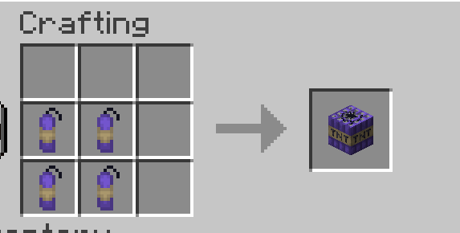
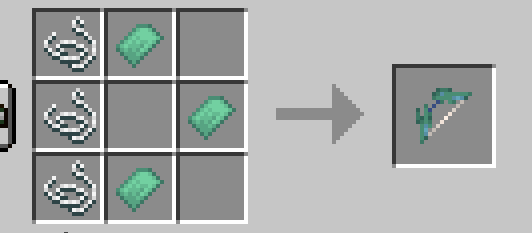

I made a simple world that has places to visit in order to acquire all the items.

- Desert Temple: 777 66 -432
- Resin tree: -331 113 -1450
- Ancient city: -282 -44 -1442
- Meteor: 606 64 -1458
- Holy Graal: 1019 -30 -822
- Greek Temple: 222 116 262

# 1. Desert Temple
In the desert temple you will find an ancient kind of TNT, made for fertilizing sourroundings and heal people.
You will find small explosives in the desert temple's hole!
 

# 2. Resin Tree
This Ultra rare tree can only be found once in lifetime! By right clicking with an axe on his logs, you will get resin, which will increase the unbreaking enchant of your items a way more than normal! In order to enchant it, hold the resin with your off hand, and your weapon with your main hand, then right-click!

# 3. Ancient City
The next item is a sword. Probably the most powerfull sword ever seen! In order to achieve it, you will have to defeat the Warden! The shadow sword is able to absorb life from other mobs to regenerate you!

# 4. Meteor
When pieces of stars fall on earth, they remain on ground as big meteors, slowly cooling. In this meteor you can find the Starlight shards, that will allow you to craft the amazing Starlight bow! Which will explode and release particle of stars when his arrows hit the ground.

# 5. Holy Graal
The holy graal is hidden in the deepest caves inside of the meeting room of the best soldiers ever. By having this item in your inventory, your life, resistance and strength will increase!

# 6. Greek Temple
Greeks hide in their temple a big secret, flying boots! With those boots, you will be able to fly in survival mode!

